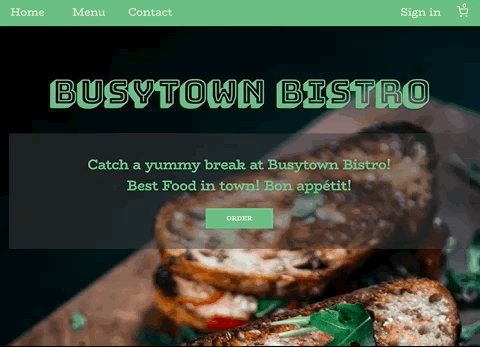

# Restaurant
## Demo
Click [here](https://wukongo-o.github.io/restaurant/) to check out the Busytown Bistro! 😋 🍔 🍹 💫

## Description
I designed and built the restaurant website for the Odin Project's fullstack JavaScript course assignment. It was originally built with pure JS. Recently I refactored the code with React and added more features.

## Features
- Order from the menu! Any menu item can be added to the shopping cart
- Newly created checkout page to display and update the order
- A sign-in page to create or sign in an account with Email and password
- User authentication via Firesbase
- CRUD operations on menu data via Firestore database

## Built with
React, Firebase, SCSS, Yarn

